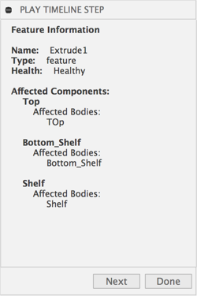

# Fusion360 Player
Utility for custom timeline playback in Fusion 360

The documentation still needs much work but here is a rough outline

_Note: there are a bunch of things I still have planned for this_

## Commands:

### Play Timeline

Allows you to step through the timeline one feature at a time and see details about that feature.

Also, only the affected bodies (and components) are displyed on each time step.

## Setup
Download or clone this repo.

Move the folder into your add-ins directory.  [Click Here](https://tapnair.github.io/installation.html) for more information

Files in the Fusion360Utilities folder should not be modified.

Rename the following items to your desired addin name:
* The top level folder
* Fusion360AddinSkeleton.py
* Fusion360AddinSkeleton.manifest

Edit the manifest file and update the fields accordingly

## License
Samples are licensed under the terms of the [MIT License](http://opensource.org/licenses/MIT). Please see the [LICENSE](LICENSE) file for full details.

## Written by

Written by [Patrick Rainsberry](https://twitter.com/prrainsberry)   (Autodesk Fusion 360 Business Development)

See more useful [Fusion 360 Utilities](https://tapnair.github.io/index.html)

